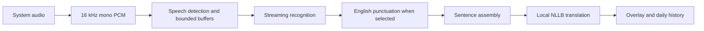

# esti-realtime-translator

A local macOS subtitle overlay for understanding Estonian lessons and English calls, with live Russian translation.

I built this personal project while learning Estonian: following a teacher in Zoom was difficult, and I wanted readable translations without sending audio to a cloud service. It was developed with an AI coding assistant and tested during a real Estonian lesson on a **MacBook Pro M1 with 16 GB RAM**.


*Screenshot uses example text, not a recorded lesson.*

## What it does

- Captures system audio from Zoom, videos, and other apps; normal audio playback continues.
- Runs streaming speech recognition and sentence-level translation locally.
- Shows a translucent, movable overlay with adjustable width, height, font size, opacity, and two-column or stacked layout.
- Keeps recent captions at the top; older captions shrink once and expire after a configurable timeout. Individual captions can be hidden.
- Saves transcript and translation history by day, and words with their original context in a separate vocabulary window.
- Supports Estonian → Russian and English → Russian profiles. Microphone capture and speaker diarization are outside the current scope.

The interface is currently in Russian. This is a personal learning aid; recognition and translation can make mistakes.

## Technology

| Component | Implementation |
| --- | --- |
| macOS interface | SwiftUI, AppKit, native floating `NSPanel` |
| System audio | Core Audio process taps through [AudioTee](https://github.com/makeusabrew/audiotee) |
| Speech detection | [Silero VAD](https://github.com/snakers4/silero-vad), ONNX Runtime on CPU |
| Estonian recognition | [TalTech Zipformer Large](https://huggingface.co/TalTechNLP/streaming-zipformer-large.et-en), streaming INT8 through [sherpa-onnx](https://github.com/k2-fsa/sherpa-onnx) |
| English recognition | [Streaming English Zipformer](https://huggingface.co/csukuangfj/sherpa-onnx-streaming-zipformer-en-2023-06-26), INT8 |
| English punctuation and casing | [Edge-Punct-Casing](https://github.com/frankyoujian/Edge-Punct-Casing), INT8 through sherpa-onnx |
| Translation | [NLLB distilled 600M](https://huggingface.co/facebook/nllb-200-distilled-600M), INT8 through [CTranslate2](https://github.com/OpenNMT/CTranslate2) and SentencePiece |
| Optional recognition | TalTech Whisper Turbo through pywhispercpp/Metal; Parakeet V3 from an existing Handy model directory |
| Optional translation | NLLB distilled 1.3B |
| Processing and persistence | Python, bounded queues, JSONL events; local JSONL/TXT history and JSON vocabulary |

## Install from source

Currently supported: **Apple Silicon macOS 14.2 or later**. Tested on M1 / 16 GB. Intel Macs and other operating systems have not been validated.

Install Xcode Command Line Tools, [uv](https://docs.astral.sh/uv/), and FFmpeg. With Homebrew:

```sh
xcode-select --install
brew install uv ffmpeg
```

Clone this repository, enter its directory, then run:

```sh
./setup.sh
```

This builds the audio capture tool, creates Python environments, downloads Silero VAD, TalTech Zipformer Large and NLLB 600M, and installs `~/Applications/Realtime Translation.app`. Allow several GB of free space for runtimes, models and build files. Model downloads require internet access; subsequent recognition and translation work offline.

For English recognition and punctuation as well:

```sh
./setup.sh --english
```

Open the installed app and grant system-audio recording permission if macOS asks. Choose a recognizer from **ET → Распознавание речи**. New installations default to TalTech Zipformer Large and NLLB 600M. Existing preferences remain in effect.

**Keep the cloned directory in place.** The app bundle launches the Python environments and models in that directory; it is not a self-contained distributable. If you move the checkout, rebuild with `./overlay/build-app.sh`. Quit the app before replacing its bundle.

Optional models:

```sh
./capture-transcription/setup-zipformer.sh       # smaller Estonian Zipformer
./capture-transcription/setup-whisper.sh         # TalTech Whisper / Metal
./translation/.venv/bin/python translation/download_nllb13.py
```

Parakeet expects an existing Handy model installation; see the [capture guide](capture-transcription/README.md). Selecting an uninstalled optional model reports an installation error.

## Use

- **Control + Option + P:** pause/resume; **Control + Option + O:** show/hide overlay.
- Drag the top handle to move the overlay between displays. Side handles resize width; the bottom handle resizes height.
- Select **Zipformer Large TalTech · эстонский → русский** for lessons or **Zipformer · английский → русский** for English calls. The profile also sets NLLB's source language.
- Click a word to save it with context. Open **Мой словарь…** or **История…** from the menu to review saved material.
- Quit through the ET menu to stop capture and finalize remaining text.

Data stays in `~/Documents/Realtime Translation/`; diagnostic logs are in `~/Library/Logs/Realtime Translation/`. Raw audio is not recorded by the normal overlay flow. No cloud inference or API keys are required. File replay and optional event-output commands are available for development.

## How it works



Zipformer processes new audio incrementally and preserves decoder state. Pauses finalize speech; long speech has a bounded window. English punctuation retains a little future context before confirming sentence boundaries. Translation assembles confirmed fragments into sentences, with a length fallback for speech without clear punctuation. Recognition, translation and UI communicate through versioned JSONL events.

On the author's M1, Zipformer Large updates were typically tens of milliseconds; short translations often took a few hundred milliseconds. These are **processing times**, not a measured guarantee of sound-to-caption latency. Buffering, acoustic context, sentence confirmation and queues also contribute. The reported usefulness in a lesson is personal experience, not a formal accuracy benchmark.

## Portability

The processing code is separated into `capture-transcription/`, `translation/` and `overlay/`. ONNX Runtime, sherpa-onnx and CTranslate2 have cross-platform runtimes, so the model-processing pieces can be adapted to Windows or Linux. A port still needs a replacement for Core Audio system capture, the native macOS overlay, packaging and permissions. It is not currently a cross-platform application.

## Development

```sh
capture-transcription/.venv/bin/python -m unittest discover -s capture-transcription/tests
translation/.venv/bin/python -m unittest discover -s translation/tests
swift build --package-path overlay -c release
overlay/.build/release/realtime-overlay --self-test
```

`./overlay/run.sh --demo` shows example captions without capturing audio. See the [Russian user guide](docs/user-guide.ru.md), [architecture](docs/architecture.md), [maintenance](docs/maintenance.md), and [contributing guide](CONTRIBUTING.md).

## License and acknowledgements

Project code is released under the [MIT license](LICENSE). Model weights and third-party libraries retain their own licenses and are downloaded separately; none are bundled in this repository.

**NLLB weights are CC BY-NC 4.0.** The default translation stack therefore has a non-commercial restriction despite the application's MIT code license. Commercial use requires a translation model with suitable terms. See [third-party notices](THIRD_PARTY_NOTICES.md) for model sources and licenses.

Thanks to TalTech's language technology team, the sherpa-onnx/icefall community, AudioTee, Silero, Meta's NLLB team, OpenNMT, and the authors of Edge-Punct-Casing and whisper.cpp.
