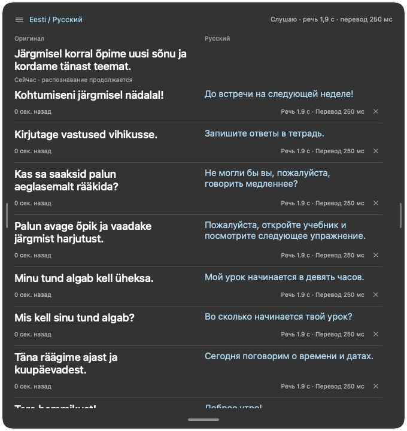
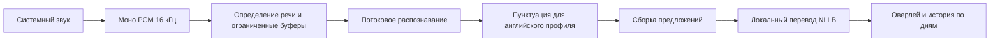

# esti-realtime-translator

Локальный оверлей для macOS: распознаёт эстонскую и английскую речь и показывает перевод на русский поверх других окон.

Я создал этот личный проект, когда начал изучать эстонский. Следить за речью преподавателя в Zoom было сложно, поэтому хотелось видеть понятный перевод без отправки аудио в облако. Приложение разработано вместе с AI-помощником и проверено на настоящем уроке эстонского на **MacBook Pro M1 с 16 ГБ оперативной памяти**.



*На скриншоте — демонстрационный текст, а не запись урока.*

## Возможности

- Захват системного звука из Zoom, видео и других приложений с сохранением обычного воспроизведения.
- Потоковое распознавание речи и перевод по предложениям полностью на компьютере.
- Полупрозрачный оверлей, который можно перемещать между экранами и настраивать по ширине, высоте, размеру шрифта и прозрачности. Оригинал и перевод располагаются в двух колонках или друг под другом.
- Свежие карточки появляются сверху. Старые один раз уменьшаются и исчезают по выбранному таймеру. Отдельную карточку можно скрыть вручную.
- История оригиналов и переводов сохраняется по дням. Слова можно добавлять в отдельный словарь вместе с контекстом.
- Профили эстонский → русский и английский → русский. Захват микрофона и определение говорящих не входят в текущую реализацию.

Интерфейс на русском языке. Это личный инструмент для обучения: распознавание и перевод могут ошибаться.

## Технологии

| Компонент | Реализация |
| --- | --- |
| Интерфейс macOS | SwiftUI, AppKit, плавающая нативная панель `NSPanel` |
| Системный звук | Core Audio process taps через [AudioTee](https://github.com/makeusabrew/audiotee) |
| Определение речи | [Silero VAD](https://github.com/snakers4/silero-vad), ONNX Runtime на CPU |
| Распознавание эстонского | [TalTech Zipformer Large](https://huggingface.co/TalTechNLP/streaming-zipformer-large.et-en), потоковая INT8-модель через [sherpa-onnx](https://github.com/k2-fsa/sherpa-onnx) |
| Распознавание английского | [Streaming English Zipformer](https://huggingface.co/csukuangfj/sherpa-onnx-streaming-zipformer-en-2023-06-26), INT8 |
| Пунктуация и регистр английского | [Edge-Punct-Casing](https://github.com/frankyoujian/Edge-Punct-Casing), INT8 через sherpa-onnx |
| Перевод | [NLLB distilled 600M](https://huggingface.co/facebook/nllb-200-distilled-600M), INT8 через [CTranslate2](https://github.com/OpenNMT/CTranslate2) и SentencePiece |
| Дополнительные модели распознавания | TalTech Whisper Turbo через pywhispercpp/Metal; Parakeet V3 из установленной модели Handy |
| Дополнительная модель перевода | NLLB distilled 1.3B |
| Обработка и хранение данных | Python, очереди ограниченного размера, события JSONL; локальная история JSONL/TXT и словарь JSON |

## Установка из исходников

Сейчас поддерживается **macOS 14.2 и новее на Apple Silicon**. Проверено на M1 / 16 ГБ. Работа на Intel Mac и других операционных системах не проверялась.

Установите Xcode Command Line Tools, [uv](https://docs.astral.sh/uv/) и FFmpeg. При использовании Homebrew:

```sh
xcode-select --install
brew install uv ffmpeg
```

Клонируйте репозиторий и запустите установку:

```sh
git clone https://github.com/sergey-verevkin/esti-realtime-translator.git
cd esti-realtime-translator
./setup.sh
```

Скрипт собирает инструмент захвата звука, создаёт окружения Python, скачивает Silero VAD, TalTech Zipformer Large и NLLB 600M, затем устанавливает `~/Applications/Realtime Translation.app`. Для окружений, моделей и файлов сборки потребуется несколько гигабайт свободного места. Интернет нужен для загрузки моделей; после установки распознавание и перевод работают без него.

Чтобы также установить английское распознавание и пунктуацию:

```sh
./setup.sh --english
```

Откройте установленное приложение и разрешите запись системного звука, если macOS запросит доступ. Модель выбирается в меню **ET → Распознавание речи**. Для новой установки по умолчанию используются TalTech Zipformer Large и NLLB 600M. Ранее сохранённые настройки сохраняются.

**Оставьте папку репозитория на месте.** Приложение запускает окружения Python и модели из неё и не является автономным переносимым пакетом. После перемещения папки пересоберите приложение командой `./overlay/build-app.sh`. Перед заменой приложения завершите его работу.

Дополнительные модели:

```sh
./capture-transcription/setup-zipformer.sh       # меньшая эстонская модель Zipformer
./capture-transcription/setup-whisper.sh         # TalTech Whisper / Metal
./translation/.venv/bin/python translation/download_nllb13.py
```

Для Parakeet нужна уже установленная модель Handy; подробности — в [инструкции по распознаванию](capture-transcription/README.md). При выборе дополнительной модели, которая ещё не установлена, приложение сообщает об ошибке установки.

## Использование

- **Control + Option + P:** пауза / продолжение; **Control + Option + O:** показать / скрыть оверлей.
- Перетаскивайте оверлей за верхнюю ручку, в том числе между экранами. Боковые ручки меняют ширину, нижняя — высоту.
- Для уроков выберите **Zipformer Large TalTech · эстонский → русский**, для английских звонков — **Zipformer · английский → русский**. Профиль также задаёт исходный язык для NLLB.
- Нажмите на слово, чтобы сохранить его с контекстом. Сохранённые материалы доступны через **Мой словарь…** и **История…** в меню.
- Завершайте приложение через меню ET: это останавливает захват и завершает обработку оставшегося текста.

Данные хранятся в `~/Documents/Realtime Translation/`, диагностические журналы — в `~/Library/Logs/Realtime Translation/`. При обычной работе оверлея исходное аудио не записывается. Облачные модели и API-ключи не нужны. Для разработки доступны обработка аудиофайлов и вывод событий в файл.

## Как это работает



Zipformer обрабатывает новые порции аудио последовательно, сохраняя состояние декодера. Паузы завершают фрагмент речи; для длинной речи действует ограничение размера окна. Английская пунктуация использует небольшой последующий контекст, прежде чем подтвердить границу предложения. Переводчик собирает подтверждённые фрагменты в предложения, а при отсутствии явной пунктуации ограничивает их длину. Распознавание, перевод и интерфейс обмениваются событиями JSONL с версией формата.

На M1 автора обновления Zipformer Large обычно обрабатывались за десятки миллисекунд, а короткие переводы — за несколько сотен миллисекунд. Это **время обработки**, а не измеренная гарантия задержки от звука до субтитров. На общую задержку также влияют буферы, акустический контекст, подтверждение предложений и очереди. Оценка полезности на уроке основана на личном опыте, а не на формальном тесте точности.

## Адаптация под другие системы

Код разделён на `capture-transcription/`, `translation/` и `overlay/`. У ONNX Runtime, sherpa-onnx и CTranslate2 есть среды выполнения для разных платформ, поэтому обработку моделей можно адаптировать под Windows или Linux. Для полноценного переноса потребуется заменить захват системного звука Core Audio, нативный оверлей macOS, упаковку приложения и работу с разрешениями. Сейчас приложение предназначено для macOS.

## Разработка

```sh
capture-transcription/.venv/bin/python -m unittest discover -s capture-transcription/tests
translation/.venv/bin/python -m unittest discover -s translation/tests
swift build --package-path overlay -c release
overlay/.build/release/realtime-overlay --self-test
```

`./overlay/run.sh --demo` показывает демонстрационные карточки без захвата звука. Дополнительные сведения: [руководство пользователя](docs/user-guide.ru.md), [архитектура](docs/architecture.md), [обслуживание](docs/maintenance.md) и [участие в разработке](CONTRIBUTING.md).

## Лицензия и благодарности

Код проекта опубликован под [лицензией MIT](LICENSE). Веса моделей и сторонние библиотеки сохраняют собственные лицензии и загружаются отдельно; они не включены в репозиторий.

**Веса NLLB распространяются под CC BY-NC 4.0.** Поэтому используемая по умолчанию модель перевода имеет ограничение на коммерческое использование, несмотря на MIT-лицензию кода приложения. Для коммерческого применения нужна модель перевода с подходящими условиями. Источники и лицензии перечислены в [уведомлениях о сторонних компонентах](THIRD_PARTY_NOTICES.md).

Спасибо команде языковых технологий TalTech, сообществу sherpa-onnx/icefall, AudioTee, Silero, команде NLLB в Meta, OpenNMT, а также авторам Edge-Punct-Casing и whisper.cpp.
